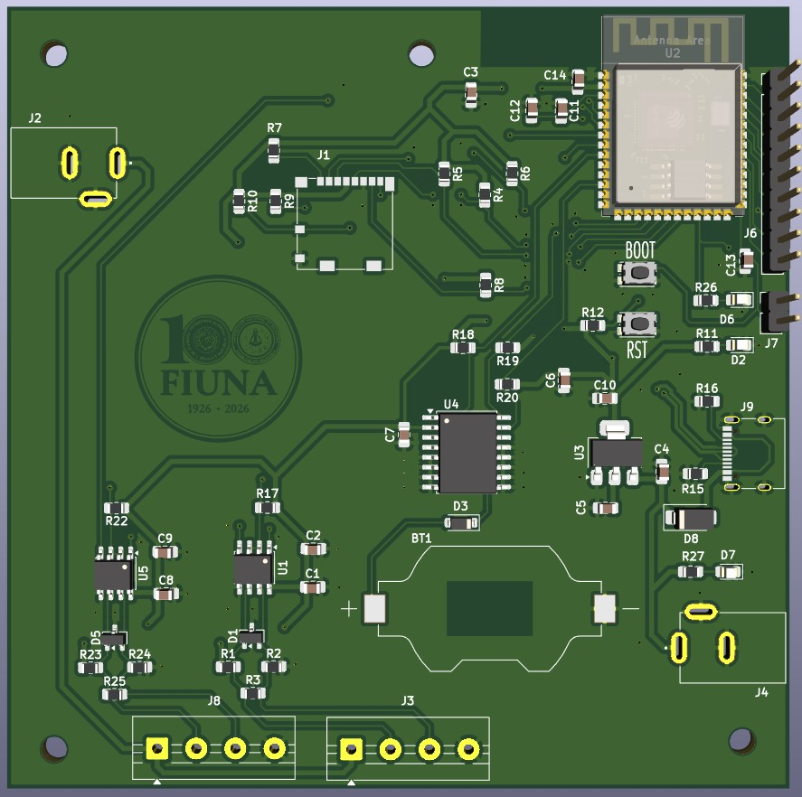
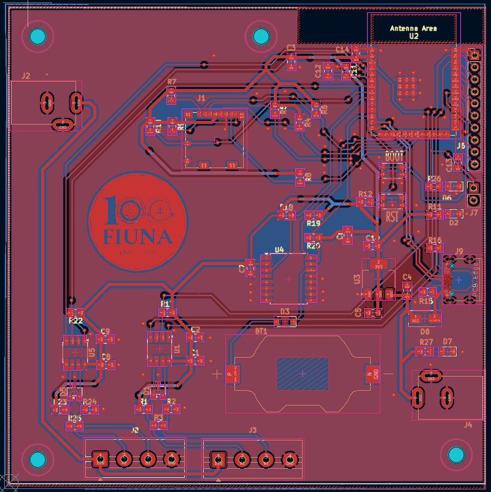
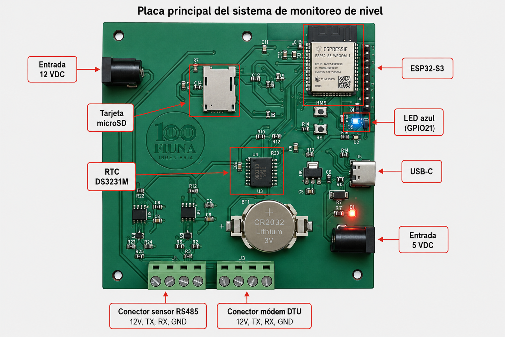

````markdown
# Sistema de adquisición y monitoreo de nivel de agua

## Estación de medición de nivel — Arroyo Mburicao

---

## Descripción

Sistema de adquisición y monitoreo de nivel de agua desarrollado para medir el nivel de un arroyo mediante un sensor de nivel con comunicación RS485.

El sistema utiliza una PCB propia basada en ESP32-S3, almacenamiento local en tarjeta microSD, reloj de tiempo real DS3231M y transmisión de datos mediante un módem DTU GPRS hacia un servidor remoto.

Cada medición es registrada con un `timestamp` generado a partir del RTC y se guarda localmente en la tarjeta microSD. Luego, el dato es enviado al servidor con la trama:

```text
d=timestamp,nivel
````

Además, el sistema implementa un mecanismo **Store and Forward**, que permite conservar los datos no enviados en caso de falla de comunicación y reenviarlos automáticamente cuando la conexión se restablece.

---

## Imágenes del hardware

| Render 3D / PCB                                                     | PCB diseñada                                                    | Placa montada                                                    |
| ------------------------------------------------------------------- | --------------------------------------------------------------- | ---------------------------------------------------------------- |
|  |  |  |

---

## Características principales

* Microcontrolador **ESP32-S3** con firmware desarrollado en **ESP-IDF**.
* Sensor de nivel de agua con comunicación **RS485 / Modbus RTU**.
* Transmisión de datos mediante **módem DTU GPRS RS485**.
* Almacenamiento local en tarjeta **microSD**.
* Registro histórico en archivo `datalog.csv`.
* Cola de datos pendientes en archivo `temp.csv`.
* Reloj de tiempo real **DS3231M** para generación de timestamps.
* Alimentación mediante **mini UPS**.
* Salida de **12 V** para sensor de nivel y módem DTU.
* Alimentación de **5 V** para el ESP32-S3.
* Regulación interna de **3.3 V** para periféricos.
* Indicadores LED de alimentación y funcionamiento.
* LED azul conectado al **GPIO21** como indicador de lectura válida.
* Mecanismo **Store and Forward** para evitar pérdida de datos.
* Reenvío automático de datos pendientes.
* Repositorio organizado en documentación, hardware, software y evidencias.

---

## Estructura del repositorio

```text
Sistema de adquisicion y monitoreo de nivel/
│
├── documentos/
│   │
│   ├── Evidencias_Pruebas/
│   │   │
│   │   ├── capturas/
│   │   │   ├── Placa.jpg
│   │   │   ├── Partes.png
│   │   │   ├── store_forward.png
│   │   │   ├── datalog_csv.png
│   │   │   └── ...
│   │   │
│   │   └── videos/
│   │       ├── prueba_sensor.mp4
│   │       ├── prueba_sdcard.mp4
│   │       ├── prueba_modem.mp4
│   │       ├── prueba_integrada.mp4
│   │       └── ...
│   │
│   └── reportes/
│       ├── informe_parcial/
│       ├── informe_final/
│       └── ...
│
├── Hardware/
│   │
│   ├── V3_Estacion_Nivel/
│   │   │
│   │   ├── imagenes/
│   │   │   ├── placa_frontal.jpg
│   │   │   ├── placa_posterior.jpg
│   │   │   ├── diseño.jpg
│   │   │   ├── Partes.png
│   │   │   └── ...
│   │   │
│   │   ├── planos/
│   │   ├── step/
│   │   ├── Librerias Kicad/
│   │   └── fabrication_files_G10/
│   │
│   └── Estacion_Nivel_V3.csv
│
├── Software/
│   │
│   ├── Firmware_Final/
│   │   │
│   │   ├── components/
│   │   │   │
│   │   │   ├── led/
│   │   │   │   ├── led_blink.c
│   │   │   │   └── led_blink.h
│   │   │   │
│   │   │   ├── modem_dtu/
│   │   │   │   ├── modem_dtu.c
│   │   │   │   └── modem_dtu.h
│   │   │   │
│   │   │   ├── reloj/
│   │   │   │   ├── reloj.c
│   │   │   │   └── reloj.h
│   │   │   │
│   │   │   ├── sdcard/
│   │   │   │   ├── sdcard.c
│   │   │   │   └── sdcard.h
│   │   │   │
│   │   │   └── sensor_rs485/
│   │   │       ├── sensor_rs485.c
│   │   │       └── sensor_rs485.h
│   │   │
│   │   ├── src/
│   │   │   └── main.c
│   │   │
│   │   ├── CMakeLists.txt
│   │   ├── platformio.ini
│   │   └── sdkconfig.freenove_esp32_s3_wroom
│   │
│   └── Firmware_Pruebas/
│       │
│       ├── components/
│       │   │
│       │   ├── led/
│       │   │   ├── led_blink.c
│       │   │   └── led_blink.h
│       │   │
│       │   ├── modem_dtu/
│       │   │   ├── dtu.c
│       │   │   └── dtu.h
│       │   │
│       │   ├── reloj/
│       │   │   ├── reloj.c
│       │   │   └── reloj.h
│       │   │
│       │   ├── sdcard/
│       │   │   ├── sdcard.c
│       │   │   └── include/
│       │   │       └── sdcard.h
│       │   │
│       │   └── sensor_rs485/
│       │       └── sensor_rs485.c
│       │
│       ├── src/
│       │   └── main.c
│       │
│       ├── CMakeLists.txt
│       ├── platformio.ini
│       └── sdkconfig.freenove_esp32_s3_wroom
│
├── .gitattributes
├── LICENSE
└── README.md
```

---

## Hardware

### Diagrama de bloques

```text
                    Mini UPS
             ┌────────┼────────┐
             │        │        │
            12 V     12 V      5 V
             │        │        │
             ▼        ▼        ▼
     Sensor de     Módem     ESP32-S3
     nivel RS485   DTU       Control principal
             │        │        │
             │        │        ├── RTC DS3231M   ── I2C
             │        │        ├── microSD       ── SPI
             │        │        ├── LED indicador ── GPIO21
             │        │        ├── Sensor nivel  ── RS485 / UART1
             │        │        └── Módem DTU     ── RS485 / UART2
             │        │
             │        └────── Internet / GPRS
             │                 │
             ▼                 ▼
        Medición de nivel   Servidor remoto
```

---

## Alimentación

| Módulo                | Tensión | Descripción                                    |
| --------------------- | ------: | ---------------------------------------------- |
| Sensor de nivel RS485 |    12 V | Alimentación del sensor de medición de nivel   |
| Módem DTU GPRS        |    12 V | Alimentación del módulo de comunicación remota |
| ESP32-S3              |     5 V | Alimentación mediante jack o USB-C             |
| RTC DS3231M           |   3.3 V | Alimentación desde regulación interna          |
| microSD               |   3.3 V | Alimentación desde regulación interna          |
| LED indicador         |   3.3 V | Indicador visual de funcionamiento             |

---

## Pinout principal

| Módulo             | Señal       | GPIO ESP32-S3 | Interfaz        | Función                            |
| ------------------ | ----------- | ------------: | --------------- | ---------------------------------- |
| Sensor nivel RS485 | TX / DI     |         GPIO1 | UART1 TX        | Envío de comando Modbus            |
| Sensor nivel RS485 | RX / RO     |         GPIO2 | UART1 RX        | Recepción de respuesta             |
| Sensor nivel RS485 | DE/RE       |         GPIO4 | Control RS485   | Control de transmisión y recepción |
| Módem DTU          | TX / DI     |         GPIO5 | UART2 TX        | Envío de trama al módem            |
| Módem DTU          | RX / RO     |         GPIO6 | UART2 RX        | Recepción de respuesta             |
| Módem DTU          | DE/RE / RTS |         GPIO7 | Control RS485   | Control de dirección RS485         |
| RTC DS3231M        | SDA         |         GPIO8 | I2C SDA         | Datos del RTC                      |
| RTC DS3231M        | SCL         |         GPIO9 | I2C SCL         | Reloj del RTC                      |
| RTC DS3231M        | SQW/INT     |        GPIO16 | Entrada digital | Señal reservada                    |
| microSD            | CS          |        GPIO10 | SPI CS          | Selección de tarjeta               |
| microSD            | MOSI        |        GPIO11 | SPI MOSI        | Datos hacia microSD                |
| microSD            | CLK         |        GPIO12 | SPI CLK         | Reloj SPI                          |
| microSD            | MISO        |        GPIO13 | SPI MISO        | Datos desde microSD                |
| microSD            | DET         |        GPIO15 | Entrada digital | Detección de tarjeta               |
| LED indicador      | LED Blink   |        GPIO21 | GPIO salida     | Indicador de lectura válida        |

---

## Software

El firmware del ESP32-S3 está desarrollado en lenguaje C utilizando **PlatformIO** con framework **ESP-IDF**.

### Módulos del firmware

| Módulo         | Descripción                                                             |
| -------------- | ----------------------------------------------------------------------- |
| `main.c`       | Flujo principal del sistema: inicialización, medición, guardado y envío |
| `reloj`        | Manejo del RTC DS3231M y generación de timestamp                        |
| `sensor_rs485` | Lectura del sensor de nivel mediante RS485                              |
| `sdcard`       | Montaje de microSD, escritura en `datalog.csv` y manejo de `temp.csv`   |
| `modem_dtu`    | Envío de trama al servidor mediante módem DTU                           |
| `led`          | Indicador visual de lectura válida o actividad del sistema              |

---

## Ciclo de operación

El ciclo principal del sistema se resume en:

```text
Medir → Validar → Guardar → Enviar → Confirmar → Reenviar si falló
```

### Flujo general

```text
Inicio
  ↓
Inicializar RTC, SD, sensor RS485, módem DTU, LED y tarea de pendientes
  ↓
Leer hora actual del RTC
  ↓
Esperar próximo intervalo de medición
  ↓
Leer nivel con sensor RS485
  ↓
¿Lectura válida?
  ├── NO → Reintentar lectura
  │          ↓
  │      ¿Falló luego de los intentos?
  │          ├── SÍ → Registrar error y esperar próximo intervalo
  │          └── NO → Continuar
  │
  └── SÍ
       ↓
Generar timestamp
  ↓
Guardar dato en datalog.csv
  ↓
Generar trama d=timestamp,nivel
  ↓
Enviar trama mediante módem DTU
  ↓
¿Servidor responde OK?
  ├── SÍ → Ciclo finalizado y esperar próximo intervalo
  └── NO → Guardar dato en temp.csv
            ↓
         Queda pendiente para Store and Forward
            ↓
         Esperar próximo intervalo
```

---

## Formato de datos

### Registro local en microSD

Archivo:

```text
datalog.csv
```

Formato:

```text
timestamp,nivel
```

Ejemplo:

```text
1779617700,0.931
```

---

### Datos pendientes

Archivo:

```text
temp.csv
```

Formato:

```text
timestamp,nivel
```

Este archivo almacena temporalmente los datos que no pudieron ser enviados al servidor.

---

### Trama enviada al servidor

Formato:

```text
d=timestamp,nivel
```

Ejemplo:

```text
d=1779617700,0.931
```

Respuesta esperada del servidor:

```text
OK
```

---

## Store and Forward

El mecanismo **Store and Forward** permite evitar la pérdida de datos cuando ocurre una falla de comunicación.

Funcionamiento:

1. El sistema mide el nivel de agua.
2. El dato se guarda siempre en `datalog.csv`.
3. El sistema intenta enviarlo al servidor.
4. Si el servidor responde `OK`, el ciclo finaliza correctamente.
5. Si el servidor no responde o existe error de comunicación, el dato se guarda en `temp.csv`.
6. Una tarea en segundo plano revisa los datos pendientes.
7. Cuando la comunicación se restablece, los datos se reenvían automáticamente.
8. Al recibir `OK`, el dato pendiente se elimina de `temp.csv`.

---

## Pruebas realizadas

| Prueba            | Descripción                                         | Estado   |
| ----------------- | --------------------------------------------------- | -------- |
| Sensor RS485      | Lectura de nivel mediante comunicación Modbus RTU   | Correcto |
| RTC DS3231M       | Lectura de fecha y hora mediante I2C                | Correcto |
| microSD           | Detección, montaje, escritura y lectura de archivos | Correcto |
| Módem DTU         | Envío de trama `d=timestamp,nivel` al servidor      | Correcto |
| Sistema integrado | Lectura, almacenamiento y transmisión completa      | Correcto |
| Store and Forward | Guardado y reenvío de datos pendientes              | Correcto |

---

## Resultados

Durante las pruebas finales se verificó que el sistema puede:

* Medir correctamente el nivel de agua.
* Generar un timestamp para cada medición.
* Guardar datos localmente en `datalog.csv`.
* Enviar datos al servidor remoto.
* Detectar fallas de comunicación.
* Guardar datos no enviados en `temp.csv`.
* Reenviar automáticamente datos pendientes.
* Mantener el timestamp original de cada medición reenviada.

---

## Evidencias

Las evidencias del funcionamiento del sistema se encuentran en:

```text
documentos/Evidencias_Pruebas/
```

Estructura recomendada:

```text
documentos/Evidencias_Pruebas/
│
├── capturas/
│   ├── Placa.jpg
│   ├── Partes.png
│   ├── datalog_csv.png
│   ├── store_forward.png
│   └── ...
│
└── videos/
    ├── prueba_sensor.mp4
    ├── prueba_sdcard.mp4
    ├── prueba_modem.mp4
    ├── prueba_integrada.mp4
    └── ...
```

Cada carpeta puede incluir capturas, logs y enlaces a videos de prueba.

---

## Costos

La lista de materiales y costos se encuentra en la carpeta de hardware del proyecto.

Ruta sugerida:

```text
Hardware/V3_Estacion_Nivel/
```

Archivo de costos o BOM:

```text
Estacion_Nivel_V3.csv
```

También pueden incluirse archivos adicionales dentro de:

```text
Hardware/V3_Estacion_Nivel/fabrication_files_G10/
```

---

## Requisitos de desarrollo

* Visual Studio Code
* PlatformIO
* ESP-IDF
* ESP32-S3
* Tarjeta microSD
* Sensor de nivel RS485
* Módem DTU GPRS RS485
* RTC DS3231M
* Mini UPS

---

## Compilación y carga

Desde PlatformIO:

```bash
pio run
pio run --target upload
pio device monitor
```

También puede utilizarse el entorno gráfico de PlatformIO en Visual Studio Code.

---

## Equipo

| Integrante                       | Contacto                                                  |
| -------------------------------- | --------------------------------------------------------- |
| Héctor Dejesús Velázquez Ojeda   | [hvelazquez@fiuna.edu.py](mailto:hvelazquez@fiuna.edu.py) |
| Mathias Ramón Aguilar DelValle   | [maguilar@fiuna.edu.py](mailto:maguilar@fiuna.edu.py)     |
| Mauricio Iván Tullo Estigarribia | [mauritullo@fiuna.edu.py](mailto:mtullo@fiuna.edu.py)         |

Institución: Universidad Nacional de Asunción — Facultad de Ingeniería
Carrera: Ingeniería Mecatrónica
Cátedra: Proyecto 3

---

## Licencia

* Hardware: CERN-OHL-P v2
* Firmware: MIT
* Documentación: MIT

---

## Estado del proyecto

El proyecto se encuentra en etapa funcional, con pruebas aisladas e integradas realizadas correctamente.

El sistema permite adquirir, almacenar y transmitir datos de nivel de agua, incorporando respaldo local y reenvío automático ante fallas de comunicación.

```
```

